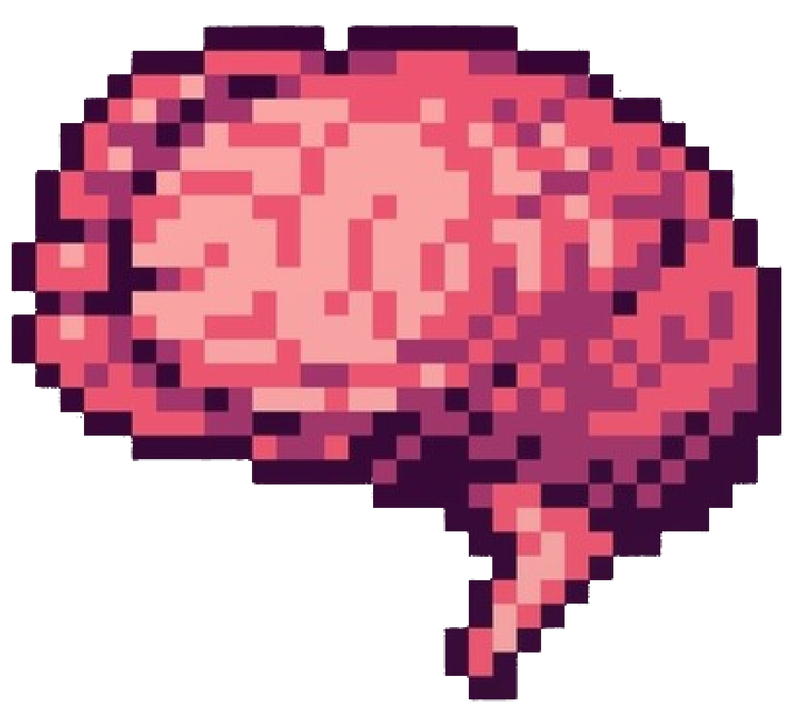

# Samuel's braindump

> _My braindump/blog/digital garden._

This is my personal collection of articles, notes, food recipes, summing up, everything I think is worth to be sharing.
Check it out at [Samuel's Braindump](https://braindump.samuelematias.com/).

[Interlude](https://github.com/samuelematias/interlude) theme is used for this static site generated with [Hugo](https://gohugo.io/).

## How it works

The [notes](notes/) folder contains [Org mode](https://orgmode.org) files that use [Org-roam](https://www.orgroam.com) to link to each other. I edit them locally using Emacs. On push Emacs is installed on CI, [ox-hugo](https://ox-hugo.scripter.co) generates hugo pages from the org files.
